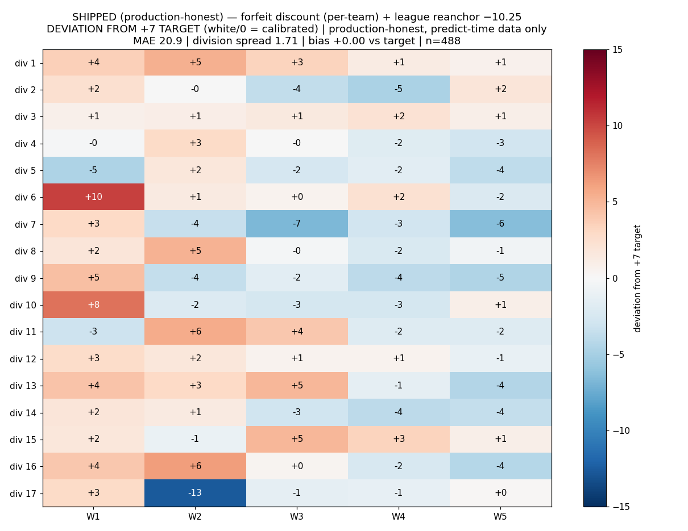

# LaneLab

A lineup optimizer and opponent-score predictor for NVSL summer swim meets.
Give it a roster and a season of results, and it picks the entry assignment
that maximizes your expected team score, then predicts what the opposing coach
will do with theirs.

## Problem

A dual meet has five age groups, hard entry rules (two individual events per
swimmer, three entries per event per team), and 5-3-1 scoring for the top
three finishers. The lineup that looks strongest on paper is usually not the
one that maximizes expected points, because finish order is uncertain and half
the field belongs to an opposing coach whose entries you won't see until meet
day.

## Approach

Assignment is an integer program (PuLP/CBC) over swimmer-event pairs under the
entry constraints. Scoring doesn't assume the fastest seed wins: each
candidate lineup gets 10,000 Monte Carlo draws over per-swimmer time
distributions. The opponent's lineup is predicted from their prior results,
recency-weighted with an age-up correction. Week 1 is the hard case, since
nobody has current-season data yet; profiles come from last year's results
plus tier-calibrated adjustments.

## Validation

The hardest prediction is Week 1, before any current-season data exists. The
Week 1 opponent predictor, backtested against held-out seasons (bias and MAE
reported separately, in meet points, because a model can have near-zero
average error while being badly wrong in both directions):

| Season          | Bias  | MAE  |
|-----------------|-------|------|
| 2024 (held out) | −0.06 | 38.2 |
| 2025            | −0.80 | 31.4 |

The heatmap is the full-league 2025 backtest: 488 team-sides through the
production pipeline. League bias lands on the +7 target, MAE 20.9, division
spread 1.71, every division within ±3.3 of target. Two calibration layers do
the work: a forfeit discount that down-weights phantom lineup fills by each
team's measured prior-year no-show rate (nothing fitted), and a single
cross-validated league-level reanchor constant. The full recalibration story,
including two evaluation-leakage bugs I found and fixed along the way, is in
[research/findings/AUG_2026_RECALIBRATION.md](research/findings/AUG_2026_RECALIBRATION.md).

There was also a higher-scoring variant. I rejected it: it improved in-sample
fit and fell apart under team-holdout cross-validation. The investigation that
proposed it is [research/findings/CALIBRATION_INVESTIGATION.md](research/findings/CALIBRATION_INVESTIGATION.md)
(kept with its SUPERSEDED banner), the rejection is in
[research/findings/CALIBRATION_STATE.md](research/findings/CALIBRATION_STATE.md),
and its heatmap sits next to the shipped one in `research/img/` as a reminder.
Baseline accuracy stats are in
[research/findings/BASELINE_STATS.md](research/findings/BASELINE_STATS.md), and
the running research log is
[research/findings/PROGRESS_AND_IDEAS.md](research/findings/PROGRESS_AND_IDEAS.md).

## Known limitations

Calibrating the bias doesn't fix the variance. Division 17's MAE is about 40
against a league-wide 21, and the cause is thin rosters: you can't predict who
shows up. One D17 meet in the backtest comes out fully inverted even on clean
data. Without live attendance information, this is close to irreducible.

The reanchor constant was fitted on the 2025 backtest. Live-season data
arrives differently (uploaded ladders instead of reconstructed history), so
the constant needs a check against live totals early next season before
anyone trusts it blindly.

Division 17 used to be much worse: a +11-to-+19 over-prediction stripe across
every week. The diagnosis (rookie times imputed from a league baseline
dominated by elite divisions) and the fixes that ended it are in
[research/findings/division17_findings.md](research/findings/division17_findings.md)
and
[research/findings/AUG_2026_RECALIBRATION.md](research/findings/AUG_2026_RECALIBRATION.md).

## Running it

    python3 -m venv venv
    source venv/bin/activate
    pip install -r requirements.txt
    python app.py

Then open http://127.0.0.1:5000/ and pick two demo teams. Cedar Hollow vs Owl
Creek, any week, is a good first run.

## Data

Nothing in this repository identifies a real swimmer. Rosters, lineups, and
result histories name children, so the real dataset stays private; the
research notes quote aggregate real-league statistics (team-level results are
public information), but no personal data. What
ships instead is a synthetic demo league: 12 fictional teams, four seasons,
120 meets, every swimmer fabricated by
[tools/make_demo_league.py](tools/make_demo_league.py). It's deterministic;
rerun it with a different seed (`python3 tools/make_demo_league.py <seed>`) to
get a different league. Every generated name was checked against the real
league's roughly 21,000 swimmer names, with zero overlap.

The validation numbers and the heatmap above come from the real league's
backtest, which can't be reproduced from this repo for the reason above. The
demo league runs the identical pipeline end to end.

The trained coach-predictor model is also not shipped, since it was fitted on
real lineups. The app falls back to a heuristic predictor without it, and
`python3 train_coach_predictor.py` (needs `scikit-learn`, included in
requirements) builds a new one once you have your own league's data.

One more provenance note: the files in `research/findings/` are the project's
real internal research logs, preserved verbatim. Line numbers, commit hashes,
scratch-file paths, and dataset statistics in them refer to the private
working repository and the full real-league dataset — not to this tree. They
are here as a record of how the modelling decisions were actually made, not as
runnable documentation.

## Notes

Built with substantial AI assistance (Claude). I designed the modelling
approach and the validation methodology; a large share of the implementation
was model-generated under my direction.
